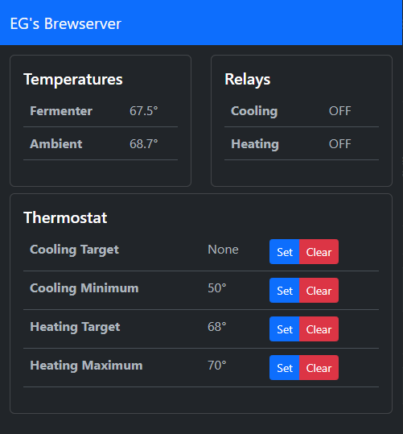

# EG's Brewserver Web UI

This is the latest incarnation of my Brewserver. This is the web UI that is served up via nginx.

It uses a bare bones setup of React and Bootstrap. No building required!

This assumes that the [brewserver](https://github.com/The-EG/brewserver)'s http api and websocket is running behind nginx at `/api`.
